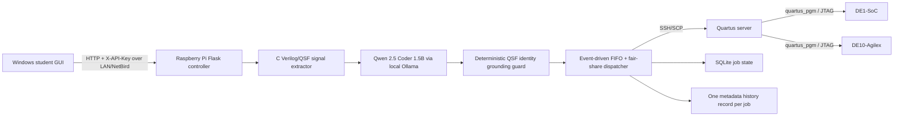

# UADY FPGA Remote Lab Controller

**Release baseline:** v5.4 Final Polished + Manual-Grounded AI Classifier Fix

A reproducible remote FPGA lab controller for routing student Verilog designs from a Windows GUI to Raspberry Pi orchestration, AI-assisted board classification, a Quartus/JTAG server, and physical **Terasic DE1-SoC** or **Terasic DE10-Agilex** boards.


## What the system does

A student submits a Verilog/SystemVerilog design plus the related Quartus files from the laptop GUI. The Raspberry Pi accepts the job, stages files temporarily, extracts current-design evidence with a C parser, asks local Qwen/Ollama to classify the target board, applies a deterministic QSF identity safety guard, assigns a matching live JTAG slot through a FIFO/fair-share dispatcher, programs the FPGA through the Quartus server, keeps the board reserved for the test interval, records one metadata history record for the job, and cleans temporary source/evidence data when the job becomes terminal.

Supported board identities in this release:

| Board | Quartus family | Authoritative QSF device IDs |
|---|---|---|
| DE1-SoC | Standard / Cyclone V SoC | `5CSEMA5F31C6`, `5CSEMA5F31C6N` |
| DE10-Agilex | Pro / Agilex 7 | `AGFB014R24B2E2V`, `AGFB014R24B1E1V` |

## Architecture



See [Architecture](docs/ARCHITECTURE.md) for the full data flow, queue state machine, persistence model, and component responsibilities.

## Repository layout

```text
.
├── gui.py                         # Main Windows/Tk GUI implementation
├── RUN_GUI.py / RUN_GUI.bat       # GUI launchers
├── UADY_SETUP.py                  # Cross-machine setup wizard
├── SETUP_CLASSIC_AND_PI.py        # Setup helper restored for this release package
├── src/uady_fpga_gui/             # Modular GUI-side helpers/models/client code
├── raspberry_pi_ai_hat/
│   ├── pi_ai_hat_controller.py    # Flask API + dispatcher + JTAG/programming controller
│   ├── UADY_PI.py                 # Pi setup/check/start CLI
│   ├── src/uady_fpga_pi/          # Pi config/runtime/JTAG helpers
│   ├── fpga_signal_extractor.c    # Current-job Verilog/QSF evidence extractor
│   ├── fpga_classifier_policy.py  # Deterministic AI grounding guard
│   ├── board_profiles.json        # Hardware/JTAG + manual-grounded board profiles
│   ├── production_policy.json     # Production dispatcher/persistence policies
│   ├── benchmark_classifier.py    # C/AI/pipeline latency + accuracy benchmark
│   └── VALIDATE_V5.py             # Release validation entry point
├── docs/                          # Complete replication and design documentation
├── deploy/                        # Service examples
├── scripts/                       # Repository-level validation
├── tests/                         # Packaging/regression tests
└── release_metadata/              # Original final-release validation metadata
```

## Quick start

### 1. Clone/download the repository on the Windows GUI computer

Requirements: Windows with Python 3.10+ recommended, network reachability to the Raspberry Pi, and the Pi API key generated by the controller.

```powershell
py -m venv .venv
.\.venv\Scripts\Activate.ps1
py -m pip install --upgrade pip
py -m pip install -r requirements_gui.txt
py UADY_SETUP.py
py RUN_GUI.py
```

The GUI stores its private settings and queue tokens in the user's OS application-data directory rather than beside `gui.py`.

### 2. Install the Raspberry Pi controller

On the Pi:

```bash
cd ~/raspberry_pi_ai_hat
python3 -m venv .venv
source .venv/bin/activate
pip install -r requirements_pi.txt
chmod +x BUILD_SIGNAL_EXTRACTOR.sh RUN_PI_CONTROLLER.sh UADY_PI.sh
./BUILD_SIGNAL_EXTRACTOR.sh
python3 VALIDATE_V5.py
python3 UADY_PI.py --setup
python3 UADY_PI.py --check
python3 UADY_PI.py --test-jtag
python3 UADY_PI.py --keys
python3 UADY_PI.py --start
```

`UADY_PI.py --setup` asks for the **Quartus server host/user, Standard and Pro `quartus_pgm` paths, project/log paths, Pi-side SSH private-key path, and job-history directory**. Deployment-specific values are saved to protected Pi storage and are not committed to this repository.

### 3. Install Ollama/Qwen on the Pi

The configured model is `qwen2.5-coder:1.5b` at the local Ollama API (`127.0.0.1:11434`). The included helper is:

```bash
cd ~/raspberry_pi_ai_hat
./INSTALL_QWEN_1_5B.sh
```

Then confirm:

```bash
curl http://127.0.0.1:11434/api/tags
```

### 4. Start and pair the GUI

Start the Pi controller first. On the Pi, print the keys with:

```bash
python3 UADY_PI.py --keys
```

In the GUI, enter the Pi NetBird/LAN address and Pi API key, save the connection, and use **Test Pi**. The API listens on port `5050` by default.

## Expected job lifecycle

```text
receiving → queued → analyzing → running/programming → testing → completed
                                    └──────────────→ failed
receiving/queued/analyzing/running/testing ───────→ cancelled
```

Important production behavior:

- FIFO scheduling is preserved among jobs competing for the same board family.
- A student is limited to **one active job** by default; completed, failed, or cancelled jobs no longer count.
- Duplicate active submissions of the same `.v/.sof` pair are rejected instead of creating duplicate jobs.
- Cancelling a job releases the user's fair-share slot immediately and, once safe to do so, releases the physical JTAG resource.
- Finishing the test interval releases the board and allows another submission.
- JTAG is prewarmed before/while idle so the first queued job is not responsible for waking the toolchain.
- Server history is configured as **one record per job**, updated across lifecycle events instead of creating duplicate records.
- Queue updates use server-sent events and event-driven wakeups; the configured broadcast cache/interval is 25 ms, but real end-to-end latency depends on the OS, network, Pi load, Ollama, SSH, Quartus, and JTAG hardware and is **not a nanosecond guarantee**.

See [Queue and job lifecycle](docs/QUEUE_AND_JOB_LIFECYCLE.md).

## AI classification safety model

The AI path is deliberately split into **reasoning** and **authority**:

1. The C extractor reads only the current job's Verilog/QSF and emits compact evidence.
2. Qwen receives a fresh stateless prompt and returns a structured decision.
3. `fpga_classifier_policy.py` checks that decision against observed identity fields.
4. A recognized QSF device ID is authoritative and cannot be overridden by hallucinated model evidence.
5. QSF-only board-template assignments are not treated as active top-level Verilog signals.
6. The selected target must agree with an enabled, matching live hardware profile before programming.

See [AI classifier and grounding](docs/AI_CLASSIFIER.md).

## Validation

Run the repository-level checks from the repository root:

```bash
python scripts/validate_repository.py
```

On the Pi, also run:

```bash
cd raspberry_pi_ai_hat
python3 VALIDATE_V5.py
python3 TEST_FPGA_CLASSIFIER_POLICY.py
```

The supplied final-release manifest explicitly states that live Raspberry Pi/Ollama/Quartus/JTAG hardware integration was **not** tested in the packaging build environment. That final hardware test must be performed after deployment.

## Documentation map

- [Architecture](docs/ARCHITECTURE.md)
- [Code guide](docs/CODE_GUIDE.md)
- [Windows GUI installation](docs/INSTALL_WINDOWS_GUI.md)
- [Raspberry Pi installation](docs/INSTALL_RASPBERRY_PI.md)
- [Quartus server and JTAG](docs/QUARTUS_SERVER_JTAG.md)
- [Configuration reference](docs/CONFIGURATION.md)
- [AI classifier and grounding](docs/AI_CLASSIFIER.md)
- [Queue and job lifecycle](docs/QUEUE_AND_JOB_LIFECYCLE.md)
- [HTTP API](docs/API.md)
- [Security and private data](docs/SECURITY.md)
- [Benchmarking](docs/BENCHMARKING.md)
- [Troubleshooting](docs/TROUBLESHOOTING.md)
- [Replication checklist](docs/REPRODUCIBILITY_CHECKLIST.md)
- [Validation report](docs/VALIDATION_REPORT.md)
- [Project evolution / design history](docs/PROJECT_HISTORY.md)
- [Publishing to GitHub](docs/PUBLISH_TO_GITHUB.md)
- [Changelog](CHANGELOG.md)

## Hardware/software assumptions

This project was designed around a three-tier lab deployment:

1. **Student laptop:** Python/Tk GUI.
2. **Raspberry Pi:** Flask API, queue/dispatcher, local Ollama/Qwen, C extractor, private SSH credentials, job-state database.
3. **Quartus/JTAG server:** Intel Quartus Standard + Pro toolchains with USB JTAG access to the FPGA boards and an SSH account reachable from the Pi.

If your Quartus toolchains and boards are connected directly to the Raspberry Pi instead, this release will require adaptation because its production programming path is designed around Pi-to-Quartus-server SSH/JTAG orchestration.

## License

No open-source license was present in the supplied final project. Before publishing publicly, the repository owner should select and add the intended license. Until then, normal copyright rules apply.
