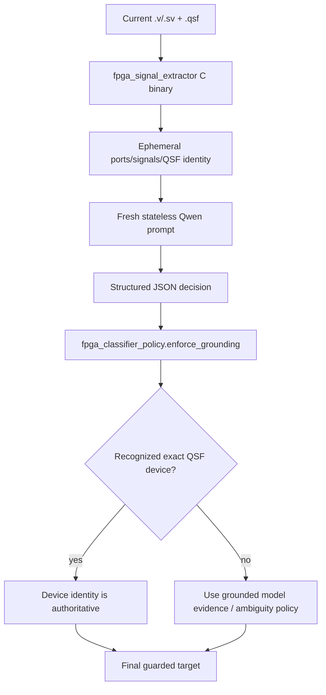

# AI Classifier and Grounding

## Goal

The classifier decides whether the submitted design targets **DE1-SoC** or **DE10-Agilex** before a physical JTAG slot is exposed to the job.

The final build intentionally does not trust a small local language model as the sole safety authority. It combines current-job model reasoning with deterministic hardware identity enforcement.

## Current pipeline



## Ollama/Qwen defaults

From `config_pi_hat.json`:

- model: `qwen2.5-coder:1.5b`;
- provider mode: strict prompt-only Qwen path;
- temperature: `0.0`;
- seed: `42`;
- context: `4096` tokens;
- output budget: `220` tokens;
- keep-alive: `10m`;
- max parallel AI inference: 1;
- minimum confidence to program: 85%;
- retry malformed/unsafe output once.

## Authoritative identity rules

Recognized device identity is stronger than model explanation or generic signals:

| Device | Final board |
|---|---|
| `5CSEMA5F31C6` | DE1-SoC |
| `5CSEMA5F31C6N` | DE1-SoC |
| `AGFB014R24B2E2V` | DE10-Agilex |
| `AGFB014R24B1E1V` | DE10-Agilex |

The profiles also check family/board-name conflicts.

## Why QSF-only signals are not active evidence

Some DE1-SoC QSF files are full board templates containing assignments for interfaces that the current Verilog module never uses. Treating every QSF target as an active feature can make a simple design look like an HPS/VGA/audio design. The final policy therefore uses actual top-level Verilog ports/signals as active signal evidence and uses QSF primarily for authoritative identity/configuration context.

## Manual-grounded fallback evidence

When exact device identity is absent, profiles include manual-derived signal families such as:

- DE1-SoC: `LEDR`, `HEX0..HEX5`, `CLOCK_50`, `HPS_*`, `DRAM_*`, `VGA_*`, `AUD_*`, plus expected widths for `SW`, `KEY`, `LEDR`, `GPIO_0`, and `GPIO_1`;
- DE10-Agilex: `SW0`, `SW1`, `BUTTON0`, `BUTTON1`, `LED_BRACKET`, `GPIO_P*`, `SI5397A_*`, `QSFPDD*`, `DDR4*`, and `PCIE_*`.

These are fallback clues. They do not override a recognized device ID.

## Statelessness and privacy

The controller does not reuse Ollama conversation context between jobs. The current job's extracted evidence is sent in a fresh prompt. The config disables persistence of the prompt, raw model response, and extracted evidence. Classifier benchmarks may record compact decision/timing fields, including `raw_ai_target` and final guarded `target_board`, so hallucinations can be measured without allowing them to route hardware.

## Test the policy

```bash
cd raspberry_pi_ai_hat
python3 TEST_FPGA_CLASSIFIER_POLICY.py
python3 VALIDATE_V5.py
```

For performance/accuracy benchmarking, see `docs/BENCHMARKING.md`.
