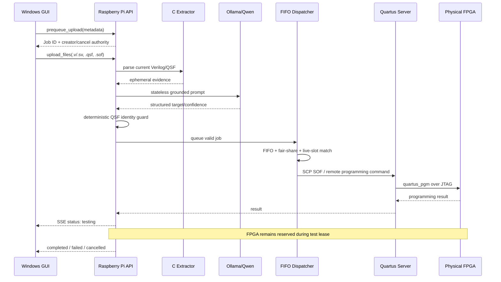

# Architecture

## System boundary

The controller separates student interaction, orchestration/AI, and vendor programming tools so that students do not need direct SSH credentials or direct access to the Quartus/JTAG server.



## Component responsibilities

### Windows GUI

`gui.py` and `src/uady_fpga_gui/` provide the user-facing application. The GUI:

- stores Pi connection information in per-user OS application data;
- stores the Pi API key in private user secret storage rather than `config.ini`;
- creates prequeue jobs before large file transfer so the server can enforce admission/fair-share rules early;
- uploads source/QSF/SOF files;
- reads board/JTAG status;
- consumes `/stream/queue` Server-Sent Events for low-latency queue updates;
- keeps creator cancellation tokens in shared private per-user storage so extracted GUI copies can still cancel jobs they created;
- supports a legacy/classic compatibility path, but the production secure mode routes programming through the Pi API.

### Raspberry Pi controller

`raspberry_pi_ai_hat/pi_ai_hat_controller.py` is the central runtime. It owns:

- Flask API and API-key authentication;
- request concurrency control;
- file staging and cleanup;
- AI classification calls;
- deterministic classifier grounding;
- live JTAG discovery/cache and slot profiles;
- event-driven FIFO dispatcher;
- fair-share and duplicate-submission checks;
- programming worker lifecycle and watchdogs;
- testing leases;
- cancellation and requeue logic;
- SSE queue broadcast;
- SQLite job persistence;
- remote job-history updates.

### Raspberry Pi manager

`raspberry_pi_ai_hat/UADY_PI.py` is the supported administrative entry point. It can save/check protected Pi settings, test JTAG, print generated GUI/API keys, and run the controller under a small Python watchdog.

### Quartus/JTAG server

The Pi uses SSH to a server that has Intel Quartus toolchains and USB access to the boards. Standard and Pro/Agilex `quartus_pgm` paths are configured independently. The server is also the intended location of `History_of_jobs`.

### FPGA profiles

`board_profiles.json` describes the supported physical board families, JTAG cable/device patterns, default JTAG device index, optional GPIO mappings, and the authoritative/manual-grounded identities used by the classifier guard.

## Job-state persistence

The production policy declares SQLite WAL storage at:

```text
~/.local/share/uady_fpga_lab/pi/jobs.sqlite3
```

SSE is transport, not storage. Terminal job records are retained so a GUI reconnect or stale planner snapshot does not make completed/failed/cancelled jobs disappear.

## Temporary data model

The configured pipeline treats `.v`, `.sv`, `.qsf`, and `.sof` as temporary job-spool data. Extractor JSON, AI prompt content, core evidence, and raw AI output are memory-only. Terminal cleanup runs for completed, failed, and cancelled jobs, with startup orphan cleanup as a fallback.

This design reduces persistence of student source and model context, but administrators should still secure filesystem permissions, swap, logs, backups, and the Quartus server independently.

## Physical resource model

A physical JTAG slot is the scarce resource. The dispatcher may know many detected slots, but a job cannot program unless:

- its AI/guarded target is valid;
- a hardware profile matches the live JTAG instance;
- the slot is enabled and free;
- the slot is not already owned by another active job;
- the job has passed upload/SOF integrity checks.

During `testing`, the physical board stays leased even though the AI inference slot is already free.
