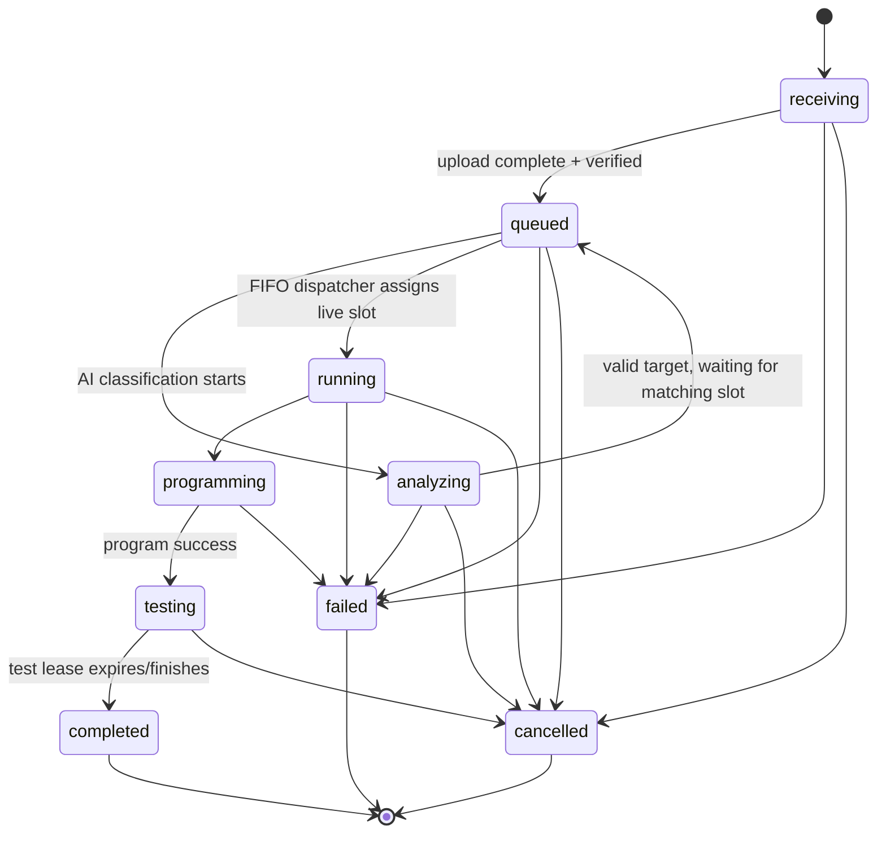

# Queue and Job Lifecycle

## Design goals

The final queue work addresses the major failure modes seen during development: waiting jobs not advancing when a board frees, inflated/stale timers, duplicate records, inability to cancel a just-created job, a student monopolizing multiple slots, first-attempt JTAG failures, and GUI/Pi/server state drifting apart.

## Lifecycle



Internally, some messages use `running/programming` semantics together; the GUI should treat programming as the active hardware-programming phase.

## FIFO behavior

The dispatcher chooses the earliest queued job that can run on a currently free compatible physical slot. A job that targets one board family should not block an earlier/later job for another family when the latter has a free compatible board, while FIFO is preserved among jobs competing for the same resource family.

The controller wakes the dispatcher on queue mutations instead of relying on long polling countdowns. Static workflow countdowns are not the source of truth for queue progression.

## Fair-share rule

Default configuration:

```json
{
  "enabled": true,
  "max_active_jobs_per_student": 1
}
```

Active means non-terminal work. Completed, failed, and cancelled jobs no longer consume the student's active-job allowance. Therefore cancellation or test completion restores eligibility for a new submission.

## Duplicate-submission rule

A stable owner identity and a `.v/.sof` submission fingerprint are used to reject an accidental double-click/reupload of the same active request. This does not permanently block the student; terminal jobs are not active duplicates.

## Upload staging

The GUI first creates a prequeue record and receives a real Job ID. It then uploads files to `/queue/<job_id>/upload_files`. This avoids the earlier failure where a missing Job ID could produce a bogus `/queue//upload_files` request and makes creator/cancel authority available before the long upload completes.

The server verifies staged SOF integrity before the job becomes runnable.

## Cancellation

Cancellation is designed to be immediate at the logical queue level but safe at the physical process boundary:

- creator authority is checked;
- active AI transport can be cancelled/invalidated;
- late worker results are ignored using job revision/state checks;
- remote Quartus work is terminated when appropriate;
- testing leases are cleared/released;
- the dispatcher is awakened so the next eligible FIFO job can start.

## Testing lease

Successful programming moves the job into a testing interval. The AI slot is free, but the physical FPGA remains reserved. When testing ends or is cancelled, the board becomes available and the user's active-job count drops.

## One history record per job

The final history config enables:

- `one_record_per_job: true`;
- `record_on_queue_accept: true`.

The same Job ID record is updated across events rather than appending multiple independent records for one submission.

## Realtime GUI synchronization

Queue SSE is event-driven. The shipped config uses a 25 ms queue/broadcast interval/cache and only sends when data changes, with heartbeat support. This is intended for millisecond-scale responsiveness on a healthy network, not nanosecond deterministic synchronization. JTAG/Quartus operations themselves are many orders of magnitude slower and dominate job latency.
